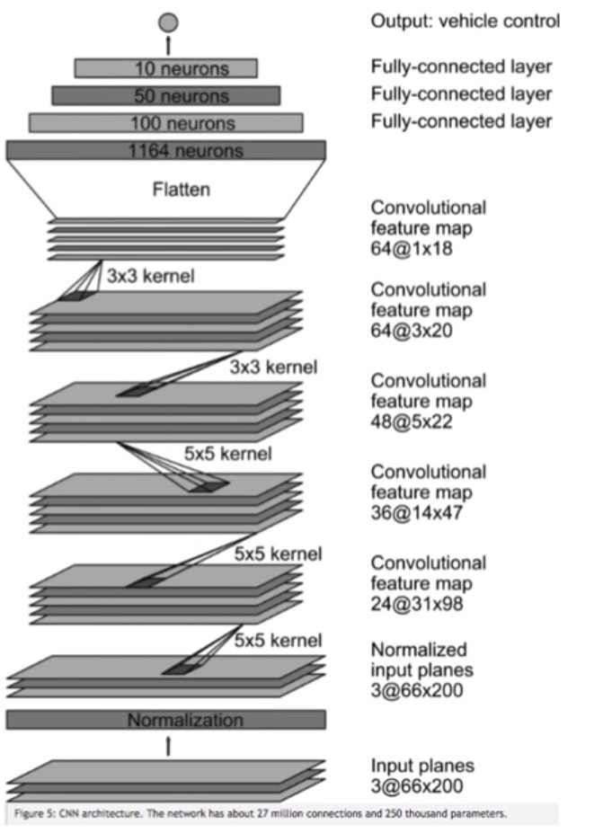
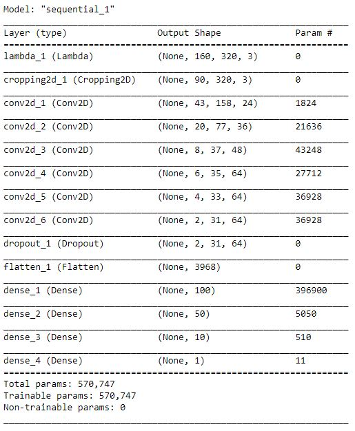
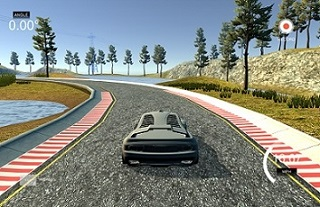
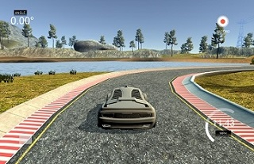
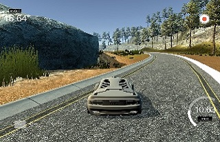
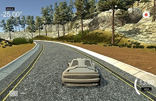

# **Behavioral Cloning** 

## Writeup - Gaurav Borgaonkar

---

The goals / steps of this project are the following:
* Use the simulator to collect data of good driving behavior
* Build, a convolution neural network in Keras that predicts steering angles from images
* Train and validate the model with a training and validation set
* Test that the model successfully drives around track one without leaving the road
* Summarize the results with a written report

---

## Rubric Points

Here I will consider the [rubric points](https://review.udacity.com/#!/rubrics/432/view) individually and describe how I addressed each point in my implementation.  

### 1. Submission includes all required files and can be used to run the simulator in autonomous mode

My project includes the following files:
* [model.py](./model.py) - containing the script to create and train the model
* [drive.py](./drive.py) - for driving the car in autonomous mode
* [model.h5](./model.h5) - containing a trained convolution neural network 
* [writeup_report_Gaurav.md](./writeup_report_Gaurav.md) - report summarizing the results
* [video.mp4](./video.mp4) - video showing the vehicle completing one lap in autonomous mode

### 2. Submission includes functional code
Using the Udacity provided simulator and my drive.py file, the car can be driven autonomously around the track by executing 
```sh
python drive.py model.h5
```

### 3. Submission code is usable and readable

The model.py file contains the code for training and saving the convolution neural network. The file shows the pipeline I used for training and validating the model, and it contains comments to explain how the code works.

---

## Model Architecture and Training Strategy

### 1. An appropriate model architecture has been employed

I started by implementing the LeNet architecture. But I found the model to be grossly underfitting in that case. Hence, I implemented the more powerful NVIDIA architecture shown below.



My model consists of a convolution neural network with 3x3 filter sizes and depths between 32 and 128 (model.py lines 18-24). The model includes RELU layers to introduce nonlinearity (code line 20), and the data is normalized in the model using a Keras lambda layer (code line 18).

In difference with the layer architecture shown above, I introduced a 50% dropout layer after the convolutional layers to reduce overfitting of the model.

Here is the model summary from my model:



### 2. Attempts to reduce overfitting in the model

The model contains one dropout layer added after the convolutional layers to reduce overfitting (model.py lines 173). The model was trained and validated on different data sets to ensure that the model was not overfitting (code line 10-16). I also tested the model several times by running it through the simulator and ensured that the vehicle could stay on the track.

### 3. Model parameter tuning

The model used an adam optimizer, so the learning rate was not tuned manually. (model.py line 184)

### 4. Appropriate training data

I created my own data by manually driving the car using the simulator. Here is the strategy I followed -

* I drove around the track as per the test mode in anti-clockwise direction first once and saved the data. I kept the car in the center of the road as much as possible and applied smaller intermittent steering movements.
* Then I again drove around the track in different sections and recorded the data only for difficult sections (more twisting, complex background). This only involved two turns as shown below:
  
     | 

* I deliberately drove off the road keeping the recording OFF and turned ON the recording to record the recovery of the vehicle. I performed this operation 4 times capturing recovery from both left laneline correction and right laneline correction. See the two images below showing the correction modes -

     | 

* To compensate the left bias and to generalize the model, I recorded one more lap of the track in reverse direction. (i.e. clockwise)

* During dataset preparation, I will flip the images in order to augment the data so that the model is more generalized.

The total data captured was about 13590 measurements.

---

## Model Architecture and Training Strategy

### 1. Solution Design Approach

The overall strategy for deriving a model architecture was to ensure that the car stays in the middle of the road. The car should also be able to correct understeer or oversteer. I attempted to reduce the validation loss by implementing different layers and dropout values.

1. My first step was to prepare dataset for training our model. I read the file *driving_log.csv* and parsed the lines to acquire the data for center, left, and right images along with the steering angles.
2. While reading the dataset, I also flipped the images to augment the dataset. I also created a correction factor for the steering correction. (I played with this parameter from 0.1 to 0.25 and finally settled on the value of 0.25.) Here is a sample of the flipped image:
   
    

    This doubled my data from 13590 to 27180 measurements.

3. I defined the NVIDIA model architecture to develop a training model. In model.fit() function, I defined my training set as 80% of measurements dataset and 20% of measurements as validation set. I also shuffled my dataset randomly.

```python
# fit model with a validation set of 20%
model.fit(X_train, steering_angles, validation_split=0.2, shuffle=True, epochs=10)
```
4. I started with epochs = 2 and found the model to be underfitting. I also checked the simulator and found that the car was driving off the road after a while.
5. I increased the no of epochs to 10 and found the training loss to be reducing and flattening with each epoch.
6. To combat the overfitting, I modified the model to include a droput layer which randomly suppresses 50% weights. I also increased the number of epochs to 10 to confirm that the model is not overfitting.
7. The final step was to run the simulator to see how well the car was driving around track one. To confirm that the car stays on the road, I tested the autonomous mode for 3 continuous laps. I also checked to see how well the car was driving itself on the track two.

At the end of the process, the vehicle is able to drive autonomously around the track without leaving the road.

### 2. Final Model Architecture

Here is the model summary:


Here is the code for the implemented model:

Model Definition:

```python
# NVIDIA network architecture
model = Sequential()
```

Normalizing the images and cropping the 50 pixels from the top and 20 pixels from the bottom 20
```python
# image preprocessing - normalizing the pixel values and cropping the image
model.add(Lambda(lambda x:(x/127.5)-1.0, input_shape=(160,320,3)))
# cropping top 50 pixels and 20 pixels from the bottom
model.add(Cropping2D(cropping=((50,20),(0,0)), input_shape=(160,320,3)))
```

1st convolutional layer with 24 filters, 2x2 strides, 5x5 kernel size and RELU activation 
```python
# 1st Convolutional layer
model.add(Conv2D(24, (5, 5), subsample = (2,2), activation="relu"))
```

2nd convolutional layer with 32 filters, 2x2 strides, 5x5 kernel size and RELU activation
```python
# 2nd Convolutional layer
model.add(Conv2D(36, (5, 5), subsample = (2,2), activation="relu"))
```

3rd convolutional layer with 48 filters, 2x2 strides, 5x5 kernel size and RELU activation
```python
# 3rd Convolutional layer
model.add(Conv2D(48, (5, 5), subsample = (2,2), activation="relu"))
```

4th convolutional layer with 64 filters, 3x3 kernel size and RELU activation
```python
# 4th Convolutional layer
model.add(Conv2D(64, (3, 3), activation="relu"))
```

5th convolutional layer with 48 filters, 3x3 kernel size and RELU activation
```python
# 5th Convolutional layer
model.add(Conv2D(64, (3, 3), activation="relu"))
```

6th convolutional layer with 64 filters, 3x3 kernel size and RELU activation
```python
# 6th Convolutional layer
model.add(Conv2D(64, (3, 3), activation="relu"))
```

Dropout layer to randomly drop 50% weights
```python
# Dropout layer
model.add(Dropout(0.5))
```

Flatten the output
```python
# flatten layers into a vector
model.add(Flatten())
```

Fully connected layers of width 100, 50, 10 and 1
```python
# four fully connected layers
model.add(Dense(100, activation='relu'))
model.add(Dense(50, activation='relu'))
model.add(Dense(10, activation='relu'))
model.add(Dense(1))
```

Model compilation using mean squared error as the loss function and Adam optimizer
```python
model.compile(loss='mse', optimizer ='adam')
```

Fitting the model with a validation set of 20% samples, random shuffling and 10 epochs
```python
# fit model with a validation set of 20%
model.fit(X_train, steering_angles, validation_split=0.2, shuffle=True, epochs=10)
model.save('model.h5')
```

I plotted the graphs of training and validation losses against the number of epochs


I ran the model for 10 Epochs and saved results from each epoch. I plotted the mean square error vs epochs and saw that mean square error for training set reduces with each epoch and remains almost constant at 0.06 and validation set remained almost constant after 5 epochs hence used the result after epoch 5 to run the model and it successfully completed the first track. Mean square error for validation set is more than the training set indicating that the model is not overfitting.

### 3. Creation of the Training Set & Training Process

Already discused above in the Solution Design Approach - **4. Appropriate Training Data.**
